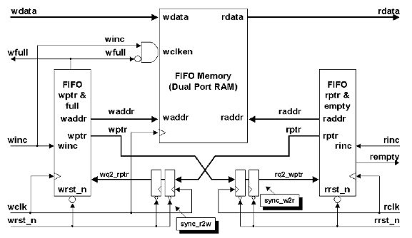
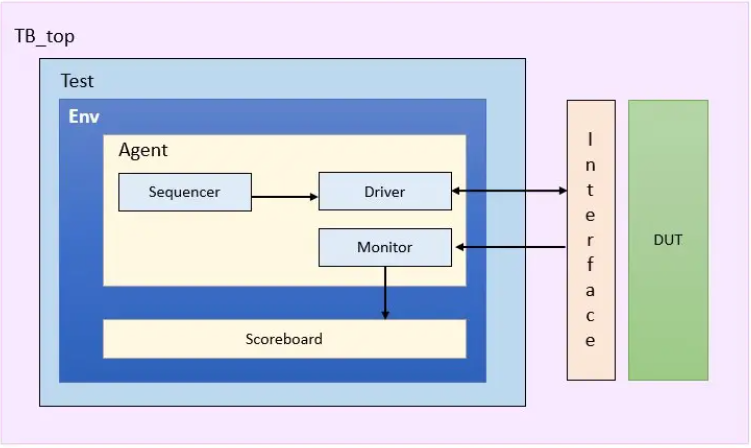
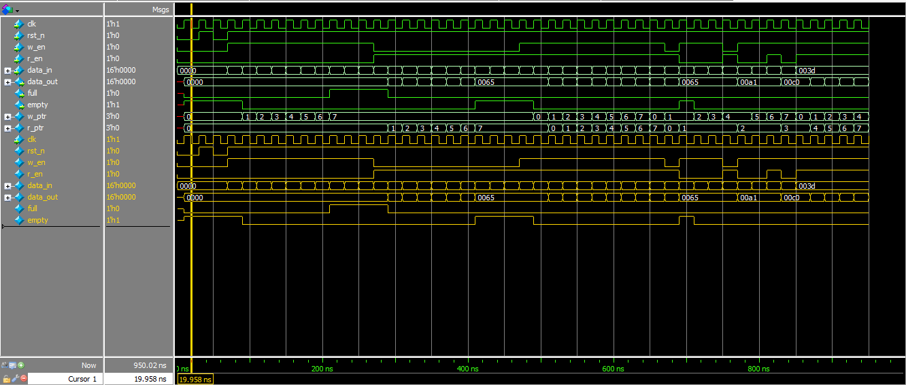
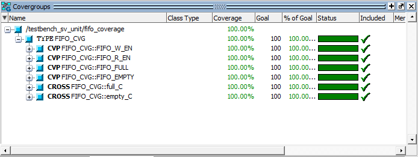
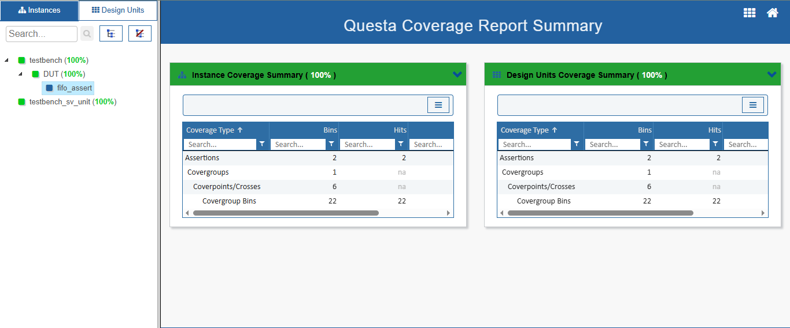

# Design and Verification using UVM for FIFO 
- A FIFO (First-In First-Out) is a memory-based data structure used to temporarily store and manage data between systems or modules that operate at different speeds or in different clock domains. 
- This project involves the Universal Verification Methodology (UVM) verification of a Synchronous FIFO design.

## 1. Directories:
- rtl               : rtl design.
- tb/top            : hvl top.
- tb/test           : tests.
- tb/env            : Environment, scoreboard ...
- tb/agents         : agents.
- tb/sequences      : sequences.

## 2. System Architecture:

## 3. Interface signals:
| Signal name   | Direction | Signal width  | Description                      
| ------------- | --------- | ------------- |-----------------------------------------------------------
| clk	        | Input     | Bit           | Clock signal.
| rst_n         | Input	    | Bit           | Active-low reset.                                        
| data_in	    | Input	    | [15:0]        | Input data bus for writing to the FIFO.
| wr_en	        | Input	    | Bit           | Write Enable: Enable data write if the FIFO is not full.
| rd_en	        | Input	    | Bit           | Read Enable: Enable data read if the FIFO is not empty.
| data_out      | Output    | [15:0]	    | Output data bus for reading from the FIFO.
| full          | Output    | Bit           | High when the FIFO is full.
| empty         | Output    | Bit           | High when the FIFO is empty.

## 4. UVM Architecture:

## 5. Sequence items:

fifo_seq_item

## 6. Sequences:

| Sequence                  |
| ------------------------- |
| fifo_reset_sequence       |
| fifo_write_sequence       |
| fifo_read_sequence        | 
| fifo_write_read_sequence  |
| fifo_random_sequence      |

## 7. Tests Scenarios:
| Test                  | Scenario                                                                                  |
| --------------------- | ----------------------------------------------------------------------------------------- |
| fifo_reset_test       | reset_sequence
| fifo_write_test       | reset_sequence -> write_sequence
| fifo_read_test        | reset_sequence -> read_sequence
| fifo_write_read_test  | reset_sequence -> write_read_sequence
| fifo_test_all         | reset_sequence -> write_sequence -> read_sequence -> write_read_sequence -> random_sequence

### Test all 

## 8. Coverage:

